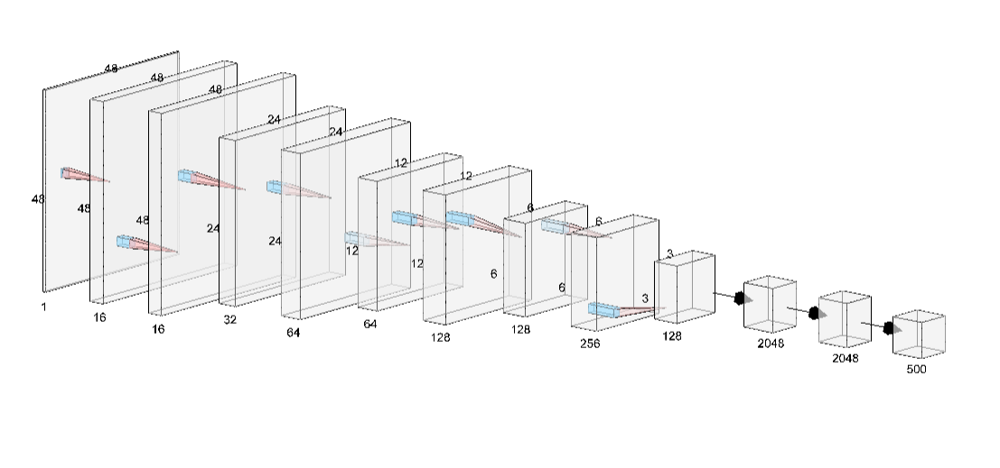
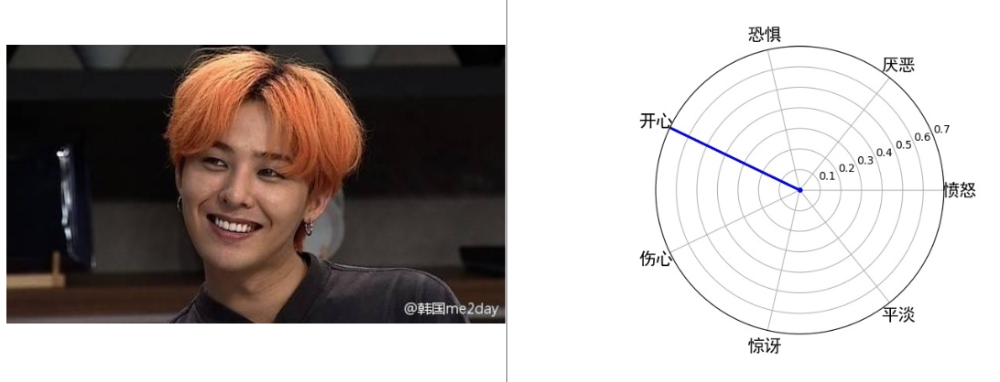
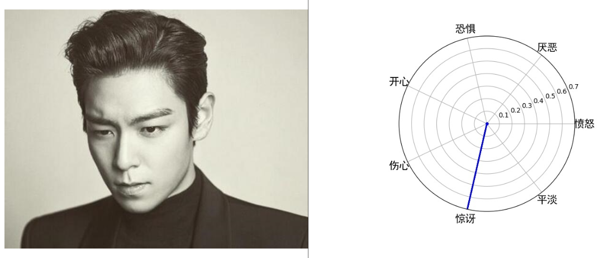
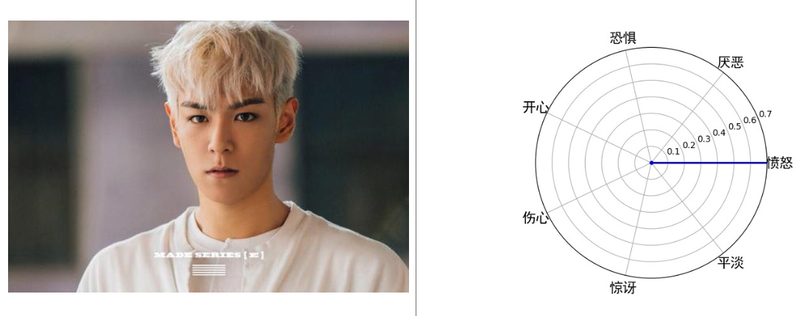
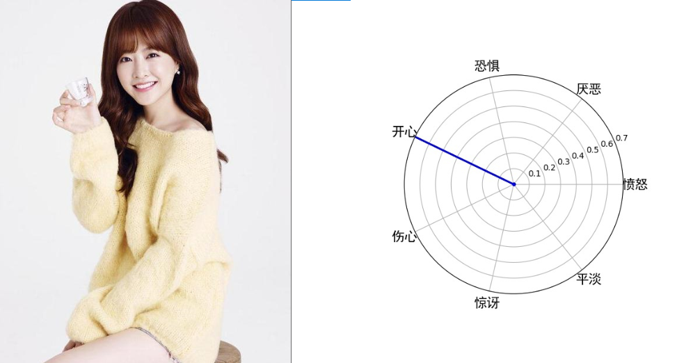

# Emotion_recognition
Using changed mini_VGG achieve emotion_recognition with FER2013 dataset. Finally, the test set can reach to 65%-66% accuracy with 60 times iteration. Using OpenCV, can realize two ways of uses, camera input and file input.

使用改变过的mini_VGG实现FER2013的表情识别，迭代60次，测试集准确率能达到65%-66%。使用opencv，支持摄像头测试和图像输入测试。

## 环境
**Win10 + core i7 7th + Nvidia Geforce 940M**

**python 3.7**

**tensorflow-gpu 2.1**

**keras 2.3.0**

## 数据集
[FER 2013 (Downloadable)]("/Code/fer2013.csv")

## 继承VGG结构的的mini_VGG
## Changed mini_VGG based on VGG

在实际使用VGG的时候发现，原本的输入层224\*224是基于*ImageNet*，而fer2013的图像都是48\*48的，直接使用VGG很容易造成过拟合，所以就把整个模型进行了缩小。

In really enviroment, the original VGG is based on the dataset *ImageNet* which the input scale is 224*224. But the picture's scale in fer2013 is 48*48, if I still use the original structure the model will overfitted. So i just shrink ever layer's size and get a good result.

## 模型结果
## Model result

    
    
    
    

